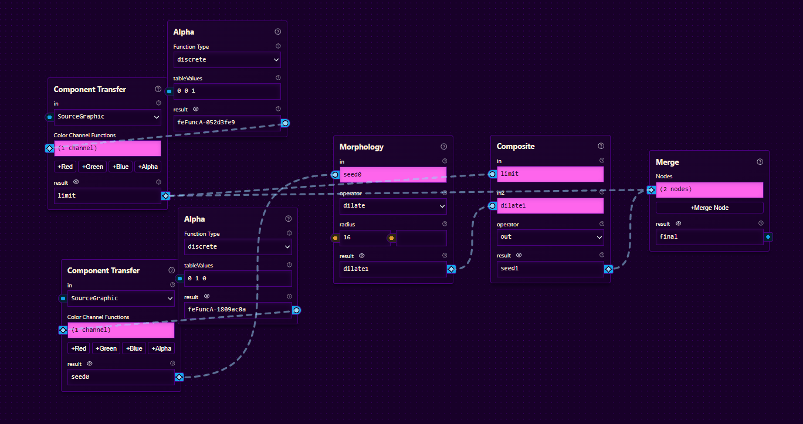

[paint.html](https://1777777777777.github.io/paint.html/) on toteutettu täysin ilman JavaScriptiä. Sivulta löytyy kynätyökalu sekä maalipurkki, joka simuloi alueen flood fillin SVG-filttereiden avulla.

Vaikka sainkin SVG-filtterit lopulta tukemaan eri värejä[^1], pitäydyn ehkä mustavalkoisessa tyylissä esteettisistä syistä. Samalla vähenee myös bugien määrä, joihin käyttäjä muuten väistämättä törmäisi. Ongelmat johtuvat pitkälti siitä, miten SVG-filtterit toimivat.

Tällä hetkellä piirroksia ei pysty tallentamaan. Sen voisi kuitenkin toteuttaa lähettämällä jokaisesta pikselistä erillisen `background-image`-kutsun palvelimelle. Maalipurkki voisi toimia samalla tavalla. Palvelin ajaisi BFS-simulaation ja tallentaisi tulokset SQLite-tietokantaan.

Sivu on testattu Edgellä ja Firefox Developer Editionilla. Koska flood fill on simuloitu SVG-filttereiden avulla siis ilman rekursiota, iterointi on koodattu suoraan HTML-tiedostoon. DOM-elementtien määrä voi siis olla hyvinkin suuri, ja sivun toimivuus on kiinni käyttäjän koneen tehoista. Jos maalipurkki ei toimi, iteraatioiden määrää kannattaa pienentää muokkaamalla HTML-tiedostoa. Iteraatioiden vähentäminen tosin vaikuttaa siihen, kuinka pitkälle täyttö leviää. Esimerkiksi omalla koneella U-kirjaimen muotoisen alueen täyttäminen vaatii vähintään 55 iteraatiota.

Aion tietenkin lisätä myös kaikki muut tehtävänannon vaatimat ominaisuudet. 

Alla oleva GIF havainnollistaa filttereiden toimintaa.[^2]

[^1]: Filtterin tyypiksi piti `table`:n sijaan laittaa `discrete`...
[^2]: Käytin filttereiden suunnitteluun [SVGFM](https://svgfm.chriskirknielsen.com/)-työkalua. Generoima koodi oli kuitenkin virheellinen ja vaati korjaamista. 
